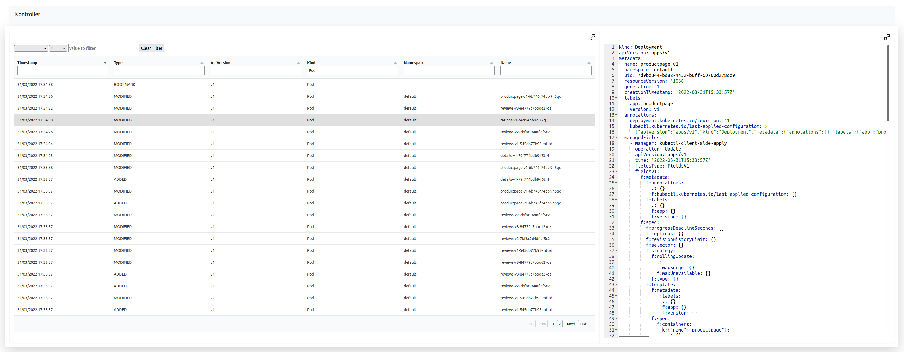

Kontroller is an open source project which helps you understanding what's happening in your Kubernetes cluster.



Kubernetes supports efficient change notifications on resources via watches. Kontroller is taking advantage of these watches to gather information about all the objects being created, modified or deleted in your Kubernetes cluster.

The Kontroller web interface is getting these notifications from the Kontroller application through the WebSocket protocol.

# Getting started

## Running the Docker image locally

```
docker run --rm -p 8080:8080 -v $HOME/.kube/config:/root/.kube/config djannot/kontroller
```

It's going to run latest version of the `kontroller` Docker image in your laptop and will connect to the current context of your local Kubeconfig.

You can see what is the current context using the following command:

```
kubectl config current-context
```

Go to http://localhost:8080 to access the web interface.

## Running the nodejs application locally

Clone this repository and run the following command to install the npm packages needed:

```
npm install
```

Run the following command to run the `kontroller` application:

```
PORT=8080 node kontroller.js
```

Go to http://localhost:8080 to access the web interface.

## Running the application on your Kubernetes cluster

Run the following command to deploy the application in the default namespace:

```
kubectl apply -f kubernetes.yaml
```

It will create a `ClusterRoleBinding` to allow `kontroller` to access the Kubernetes API server.

Run the following command to make the application available locally:

```
kubectl port-forward svc/kontroller 8080
```

Go to http://localhost:8080 to access the web interface.